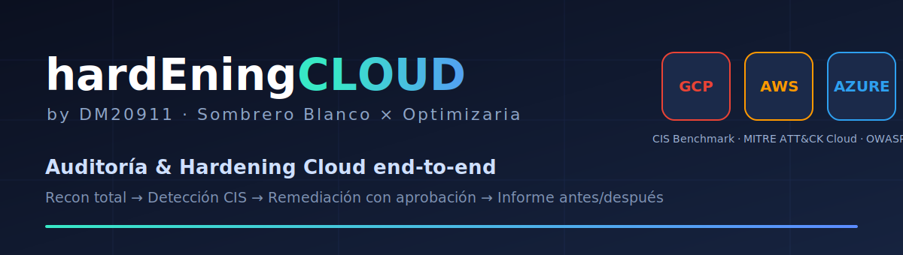
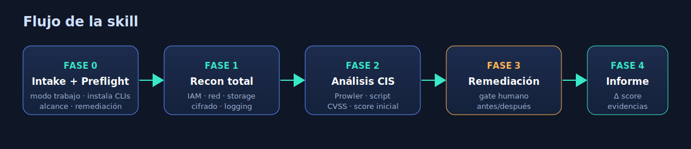
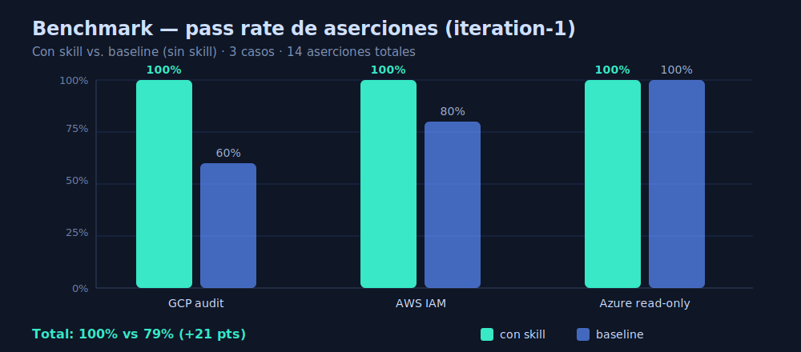

<p align="center">
  
</p>

<h1 align="center">hardEningCLOUD_byDM20911</h1>

<p align="center">
  <b>Auditoría y hardening integral de la nube — GCP · AWS · Azure — de punta a punta.</b><br/>
  Recon total → Detección CIS → Remediación con aprobación humana → Informe antes/después.
</p>

<p align="center">
  
  
  
  
</p>

<p align="center">
  <i>Una skill de <a href="https://github.com/SombreroBlanc0">Sombrero Blanco</a> × <a href="https://optimizaria.com">Optimizaria</a></i>
</p>

---

## ¿Qué es?

No es solo un escáner. Es un **flujo de trabajo completo** que toma un proyecto cloud y lo deja
medible y verificablemente más seguro:

1. **Descubre todo** lo que hay en la cuenta/proyecto/suscripción.
2. **Encuentra** vulnerabilidades y malas configuraciones contra **CIS Benchmark**.
3. **Las corrige** — con **aprobación humana previa** a cualquier cambio.
4. **Lo documenta** en un informe con **antes/después** y delta del score de postura.

La mayoría de las herramientas listan hallazgos y se detienen. Aquí el valor está en **cerrar el
ciclo**: el informe gira en torno a un **score de postura** (% de checks CIS que pasan) que sube
tras la remediación, con evidencia reproducible de cada cambio.

<p align="center">
  
</p>

---

## Características

| | |
|---|---|
| ☁️ **Multi-cloud real** | GCP, AWS y Azure con enumeración viva por dominio (IAM, red, storage, cifrado, logging). |
| 🛡️ **CIS + MITRE + OWASP** | Hallazgos clasificados contra CIS Benchmark, mapeados a MITRE ATT&CK Cloud y OWASP. |
| 🤝 **Remediación con gate humano** | Lectura libre; **toda escritura requiere aprobación explícita**. Reglas anti-lockout. |
| 🔧 **Preflight de herramientas** | Verifica e instala las CLIs necesarias (gcloud/aws/az, Prowler, ScoutSuite) antes de empezar. |
| 📊 **Informe antes/después** | Score de postura inicial vs. final, evidencia por hallazgo, archivo de evidencias. |
| 🧩 **Modo de trabajo configurable** | CLI directo, copy-paste (apto VPN/zsh) o híbrido — lo decide el usuario en el intake. |

---

## Modos de IA soportados

Esta skill se distribuye para varios runtimes de IA. Misma metodología, mismo script, distinto envoltorio.

| Runtime | Carpeta | Punto de entrada |
|---------|---------|------------------|
| **Claude Code / Claude.ai** | [`claude/`](claude/) | `SKILL.md` (frontmatter de skill) |
| **Gemini CLI** | [`gemini/`](gemini/) | `GEMINI.md` |
| **Codex / agentes genéricos** | [`local-ai/`](local-ai/AGENTS.md) | `AGENTS.md` |
| **LLM local (Ollama / LM Studio)** | [`local-ai/`](local-ai/ollama-system-prompt.md) | `ollama-system-prompt.md` |

---

## Instalación

### Claude Code (skill)
```bash
git clone https://github.com/DM20911/hardEningCLOUD_byDM20911.git
cp -r hardEningCLOUD_byDM20911/claude ~/.claude/skills/hardEningCLOUD_byDM20911
```
Luego, en Claude Code: *"audita mi proyecto GCP / AWS / Azure"* y la skill se activa.

### Gemini CLI
```bash
cp hardEningCLOUD_byDM20911/gemini/GEMINI.md ./GEMINI.md   # en la raíz de tu proyecto
```

### LLM local
Copia `local-ai/ollama-system-prompt.md` como *system prompt* de tu modelo (Ollama, LM Studio, etc.).

---

## Uso (flujo típico)

```
Tú:    audita mi proyecto GCP acme-prod-123 y arregla lo crítico
IA:    [Fase 0] ¿Cómo trabajamos? (CLI directo / copy-paste / híbrido)
       [Preflight] Falta gcloud y prowler — ¿los instalo? (sí/no)
       [Plan] Cubriré: IAM, red, storage, cifrado, logging (CIS GCP)
       ...
       [Fase 2] Score inicial: 61% · 4 críticos, 7 altos
       [Fase 3] Hallazgo #1 (Critical): bucket público gs://... 
                Fix propuesto: gcloud storage buckets update ... ¿aplico? (sí/no)
       ...
       [Fase 4] Score final: 92% (+31 pts) · informe.md + evidencias.md generados
```

---

## Benchmark

Evaluación con subagentes independientes, **con skill vs. baseline (sin skill)**, 3 casos reales,
14 aserciones objetivas.

<p align="center">
  
</p>

| Caso | Con skill | Baseline |
|------|:---------:|:--------:|
| Auditar GCP y remediar | **5/5** | 3/5 |
| Revisar política IAM AWS (JSON) | **5/5** | 4/5 |
| Endurecer Azure en modo solo-lectura | **4/4** | 4/4 |
| **Total** | **14/14 (100%)** | **11/14 (79%)** |

> La skill gana sobre todo en disciplina de proceso: pedir el modo de trabajo, preflight de CLIs y
> plan CIS estructurado (que el baseline omite), además del uso correcto del analizador de IAM.
> Informe completo: [`docs/brochure.pdf`](docs/brochure.pdf).

---

## Estructura del repo

```
hardEningCLOUD_byDM20911/
├── claude/          # Skill para Claude Code (SKILL.md + scripts + references)
├── gemini/          # Versión Gemini CLI (GEMINI.md)
├── local-ai/        # AGENTS.md (Codex/genérico) + system prompt para LLM local
├── assets/          # Imágenes (SVG)
├── docs/            # Brochure/benchmark en PDF
├── benchmark/       # Resultados de la evaluación
└── README.md
```

---

## Aviso ético

Esta herramienta asume **autorización explícita** sobre los objetivos auditados (recursos propios o
de clientes con contrato de pentesting). No la uses contra infraestructura sin permiso. Toda
escritura sobre la nube requiere aprobación humana por diseño.

---

## Autores

- **Sombrero Blanco** — [@SombreroBlanc0](https://github.com/SombreroBlanc0)
- **Optimizaria** — [optimizaria.com](https://optimizaria.com)

Licencia [MIT](LICENSE).
